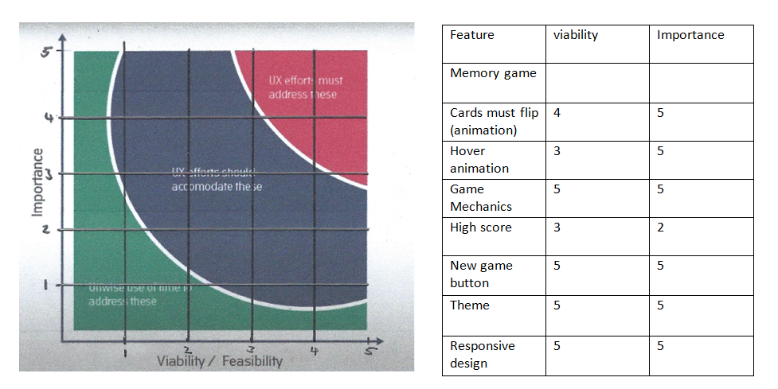

# Hearthstone Memory Game

Creating a custom memory game is something you would never think would be possible.
I have decided to take one of my favorite (and addicting) video games and turn it into a memory game.
This is "Hearthstone Memory". This is to be played in the exact same way as the original memory game, from Hasbros.
 
## UX
### High level considerations

Content on the site is culturally appropriate. The site only contains a game and a refresh button with a score, there is no malicious content. The target audience is mostly for children and teenagers looking to develop their attention and concentration. The theme of the game is based off “Hearthstone”, a strategy game owned by Blizzard. This means that the game and its theme are directed at cognitive development. “Hearthstone” does contain the same amount of violence as chess. This memory game contains no violence what so ever to make sure the site does not trigger the debate “do video games make children more violent”.  

As this game is relative to children it can be accessed by anyone looking to develop their brain’s functions. It can also be accessed in schools that have the appropriate technology available for children. The Theme of the game is based off a strategy game, thus all the contents of the site are directed at cognitive development. 

We can track and catalogue the content in an intuitive way. There can be future features where levels are incorporated that have cards from different expansions from “Hearthstone”, to prevent users from getting bored of the content. This means that we will have to create more cards, therefore we cannot just have heroes (like in the current version), and we will have to incorporate spell cards, secrets, monsters and weapons. We will also try to incorporate the High score system, which was traded off due to a lack of viability (see testing for more information). 

The current medium for a memory game is a physical version which, according to “Amazon”, would cost a user £5-£20. “Hearthstone memory” however would cost the user less and still develop their brains in the same way. “Hearthstone memory” is going to be submitted as an educational piece of work to Code Institute and as such, will not be monetized; this will mean it will not trigger any copy right violations. 

I used the most modern versions of HTML (HTML5), CSS (CSS3) and JavaScript to develop this game. I ran the code through “AutoPrefixer” to make it more “available” for any browser a user chooses to use to access the site. 

### Business goals 

This project is unique in the sense of its theme. The memory game itself is not unique as there are hundreds of different versions available. What differentiate other versions of the game are their themes. This would mean that this “Hearthstone memory” is unique in its own way, disregarding the fact that it is online, which is another unique feature.

Due to the fact that this project was inspired by Code Institute, it means that thousands of students have probably submitted a memory game as their milestone project since the Institute was established. Therefore we know there are many people who have submitted a similar project. We do not have access to any of their code thus we cannot tell how well they did. I am also submitting a memory game as my milestone project, thus I know that this project has the same viability as most other projects submitted. Unfortunately that means it will not be monetized.  

 The only issue that arises is that its theme is based off “Hearthstone” which is already owned by Blizzard. We can curb this issue as there are many knock off apps on any app store related to other games. For example, there was a “Call of Duty Black Ops 2” class editor available on the app store in 2013 when Call of Duty Black Ops 2 was booming on PlayStation and Xbox and there have been no repercussions. 
The major tech considerations we need to establish is that the user needs a mobile device or PC that they can use with internet access, to play this game. No special skills are needed. 
The Users we are aiming at are children and teenagers. The purpose of this product is to provide educational and entertaining content. The product has no key position in society like a heart rate monitor or a computer. “Hearthstone memory” is an alternative to the traditional memory game. 

There are no stakeholders in the project. I am the only person working on it and I am not monetising it. I do not see future stakeholders participating in this project as it is on the edge of a copyright claim but it is for my milestone project at Code Institute, thus it is used for educational purposes only. 

The only other people I know that are doing something similar is Code Institute students. I do not have access to their code and projects, thus I have no idea what they are doing or how they did it.  I am following my own intuition and doing what I think is best. Other memory games that are online, like [helpfulgames.com]( https://www.helpfulgames.com/subjects/brain-training/memory.html) have been coded in a similar way as my project. Inspiration has been drawn from this project.  

This is a very minimalistic website, thus there is not a lot of features to add. As the project was being developed, users were interviewed looking for bugs in the code. See the “testing” section for more details.

Doing an existing product audit, I can see there are some improvements to be made. I would like the “new game” button to not just refresh the page, but to actually flip the cards over, shuffle them and allow users to click on them again. The issue arises with some bugs; there was a bug where users were able to double click on one card and the code would determine that there was a match. To hinder this, a “board lock” feature has been incorporated (see comments on assets/js/script.js) but this means that cards were not able to be clicked (“flipped over”) on the second round even after variables and cards were cleared for a new game. The second improvement I would like to make is to incorporate a high score. This would have been possible but first the “new game” button had to be fixed first so that the score can be pushed into an array, the array be sorted in an ascending order, and then the top 10 scores would be shown. If the score was lower than 8, it would not be counted as this would mean that a game was incomplete as there are 9 pairs of cards. This has been discussed with my mentor but due to a lack of viability this was not incorporated. Apart from those 2 failed features, I believe the coding for the bug fixes, the animation, the display of images and the game mechanics was well executed and I am proud with what I have done. I am aware that it is not the best memory game out on the market but it was my best effort. 

### B2B vs B2C

As this is an educational piece of work with no form of monetization to prevent a copyright violation, this section will be minimal as monetizing this, is unethical and unlawful. There will be no online purchases; the emotional transactions will be simple and basic, with no branding, minimal content with large images. If anything is to be said about this product in this section, it should be considered as a B2C product. 

### Strategy Trade-offs 

Looking at what values I provide to set me apart from competitors is that I need to start by looking at the target audience. My target audience is children and teenagers. They are in the stages of brain development, thus minimal distractions need to be present. They also need to be accommodated on any device they are using. They might be advised by a guardian (teacher/parent) to play the game or do it out of free will. The final product needs to have a “gaming” feel to it, to distract them from the core purpose of the site; like taking medicine, if it tastes good then you will be more compelled to take it rather than hating it. 

The users are expecting to play a game when the site is loaded. The user doesn’t need a lot of intuition to notice this. There needs to be an immediate display of cards and a new game button to show a user this, which there is. There is no input field for information thus it can be seen as a trusted site, that won’t farm data. There is no place for users to give feedback/contact me which is valued since having such fields will just create problems such as: the users might request something that they do not necessarily need. 

Now I will have to look at the trade-off. Our total importance is 32, our average viability is 4.29 (2 dp). Multiplying our average viability by the number of items, we get 30. Our importance is greater than our viability, thus not all features can be implemented. We will have to scrap a few/one feature. In this case, I believe it should be the high score as mentioned above, in the existing product audit. 

Use this section to provide insight into your UX process, focusing on who this website is for, what it is that they want to achieve and how your project is the best way to help them achieve these things.

In particular, as part of this section we recommend that you provide a list of User Stories, with the following general structure:
- As a user type, I want to perform an action, so that I can achieve a goal.

This section is also where you would share links to any wireframes, mockups, diagrams etc. that you created as part of the design process. These files should themselves either be included as a pdf file in the project itself (in an separate directory), or just hosted elsewhere online and can be in any format that is viewable inside the browser.

## Features

In this section, you should go over the different parts of your project, and describe each in a sentence or so.
 
### Existing Features
- Feature 1 - allows users X to achieve Y, by having them fill out Z
- ...

For some/all of your features, you may choose to reference the specific project files that implement them, although this is entirely optional.

In addition, you may also use this section to discuss plans for additional features to be implemented in the future:

### Features Left to Implement
- Another feature idea

## Technologies Used

In this section, I mention all of the languages, frameworks, libraries, and any other tools that I have used to construct this project.

### Lanuages 

- [HTML](https://en.wikipedia.org/wiki/HTML5)
- [CSS](https://en.wikipedia.org/wiki/Cascading_Style_Sheets#CSS_3)
- [JavaScript](https://en.wikipedia.org/wiki/JavaScript)

### Tools 
- [Autoprefixer](https://autoprefixer.github.io/)
- [Markup Validation service](https://validator.w3.org/) 
- [GitHub](https://github.com/)
- [Git](https://git-scm.com/)
- [Gitpod](https://chrome.google.com/webstore/detail/gitpod-online-ide/dodmmooeoklaejobgleioelladacbeki?hl=en)
- [VSC](https://code.visualstudio.com/download) 
- [Microsoft Office](https://www.office.com/)
- [favicon](https://www.favicon.cc/)

### Frameworks

- [Bootstrap](https://getbootstrap.com/)

### libraries
- [JQuery](https://jquery.com)

## Testing

During various branches, which have been merged to the final 
materbranch, I have tested the game on twin teenagers (16). 
They have supplied feedback wich has been taken care of as some of their input was implemented. These have 
been documented in this section. 

Initially we tried to implement testing via [jasmine](https://jasmine.github.io/) but that was not possible since I had to parce
values into a function to test it,which was not possible for the code I had written. This means that I had to 
resort to physical testing. 

- Test 1: Animating the  cards to flip 
    - Some time was spent on [researching the 3d persepctive css property](https://3dtransforms.desandro.com/perspective).
    - Then some time was spent on [how to flip cards using css](https://www.w3schools.com/howto/howto_css_flip_card.asp).
    - mutiple  attempts was made to flip cards on click (via a css class "flip"), and then the successful version was commited.
    - Cards now successfully flip with no bugs.

- Test 2: Matching the cards
    - We needed to make sure the cards match and to do this I researched the [data match attribute](https://www.w3schools.com/tags/att_data-.asp).
    - we then used the "data-match" attribute with a assigned value that will be compared in script.js.
    - cards will be given the class of "flip" and then the code will run
    - the "data-match"values will be compared and if they match the cards will not be able to flip back; for this we turned off their click fucntions and assigned different value to their variables.
    - If the "data-match" values do not match, the cards will be unflipped by removing the "flip class"
    - Some bugs were discovered at this Stage

- Test 3: Bug 1; Speed runs
    - If a user was to quickly click through the matches, more than 2 cards would be revealed
    - I created a setTimeout() function and a lock variable.
    - The setTimout functions displays the faces of the cards for a certain period of time before the cards are unflipped (the "flip" class was removed)
    - In the mean time while the card's faces were shown the board would be locked (lock variable).
    - Bug was successfully removed, a user can no longer click through the cards at random speeds. 

- Test 4: Bug 2; Single card matching with itself
    - When double clicking on a card a match would happen
    - To prevent this the cardFlipped variable and the lock variable were created.
    - If the card was already flipped the function which would run the match check would not be activated
    - Bug was successfully removed, no double click matches would happen

- Test 5: Cards shuffle every new game
    - I created a self invoking function that assignes a random number between 1-18 to each card
    - Then the cards are sorted in the order the random number is assigned to them.
    - This happens each time the page loads
    - Each time the page is loaded this function happens successfully.

- Test 6: Creating a new game
    - Due to the code invoked for the bugs, starting a new game without refreshing the page is a strenuous task
    - This resulted in the "new game" button becoming a page refresh button
    - This also prevented the "high score" feature to be implemented 
    - page now refreshes and the game is reset properly but the highscore feature has to be removed.

Essentially, in this 
part you will want to go over all of your user stories 
from the UX section and ensure that they all work as intended, 
with the project providing an easy and straightforward way for 
the users to achieve their goals.

Whenever it is feasible, prefer to automate your tests, and if you've done so, provide a brief explanation of your approach, link to the test file(s) and explain how to run them.

For any scenarios that have not been automated, test the user stories manually and provide as much detail as is relevant. A particularly useful form for describing your testing process is via scenarios, such as:

1. Contact form:
    1. Go to the "Contact Us" page
    2. Try to submit the empty form and verify that an error message about the required fields appears
    3. Try to submit the form with an invalid email address and verify that a relevant error message appears
    4. Try to submit the form with all inputs valid and verify that a success message appears.

In addition, you should mention in this section how your project looks and works on different browsers and screen sizes.

You should also mention in this section any interesting bugs or problems you discovered during your testing, even if you haven't addressed them yet.

If this section grows too long, you may want to split it off into a separate file and link to it from here.

## Deployment

This section should describe the process you went through to deploy the project to a hosting platform (e.g. GitHub Pages or Heroku).

In particular, you should provide all details of the differences between the deployed version and the development version, if any, including:
- Different values for environment variables (Heroku Config Vars)?
- Different configuration files?
- Separate git branch?

In addition, if it is not obvious, you should also describe how to run your code locally.

## Credits

### Content
- The text for section Y was copied from the [Wikipedia article Z](https://en.wikipedia.org/wiki/Z)

### Media
- The card back was optained from [engadget](https://www.engadget.com/2014-02-26-new-hearthstone-card-backs-revealed.html)
- The card front for Jaina Proudmoore was optained from [HearthstoneWiki](https://hearthstone.gamepedia.com/Jaina_Proudmoore)
- The card front for Rexxar was optained from [HearthstoneWiki](https://hearthstone.gamepedia.com/Rexxar)
- The card front for Malfurion Stormrage was optained from [HearthstoneWiki](https://hearthstone.gamepedia.com/Malfurion_Stormrage)
- The card front for Uther Lightbringer was optained from [HearthstoneWiki](https://hearthstone.gamepedia.com/Uther_Lightbringer)
- The card front for Anduin Wrynn was optained from [HearthstoneWiki](https://hearthstone.gamepedia.com/Anduin_Wrynn)
- The card front for Valeera Sanguinar was optained from [HearthstoneWiki](https://hearthstone.gamepedia.com/Valeera_Sanguinar)
- The card front for Thrall was optained from [HearthstoneWiki](https://hearthstone.gamepedia.com/Thrall)
- The card front for Gul'dan was optained from [HearthstoneWiki](https://hearthstone.gamepedia.com/Gul%27dan)
- The card front for Garrosh Hellscream was optained from [HearthstoneWiki](https://hearthstone.gamepedia.com/Garrosh_Hellscream)

### Acknowledgements

- I received inspiration for this project from Code Institute who recommended a memory game for my MS2. 